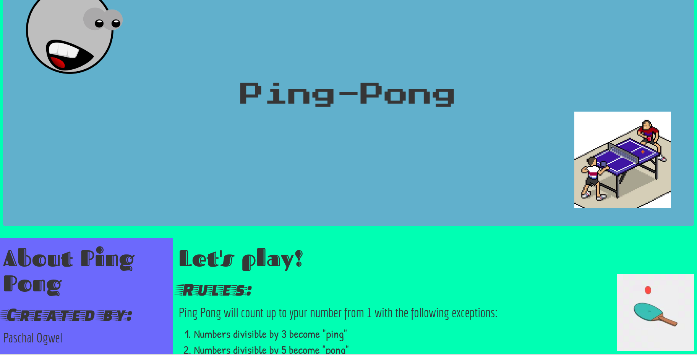

# Ping Pong
#### Displays different output depending on the divisibility of the number, 2018
#### By **Paschal Ogwel**
## Description
This is a game that lets you enter a number and if it is divisible by 3 it returns "ping" and if its divisible by 5 returns "pong" and a number divisible by both 3 and 5 it returns "pingpong".

## Setup/Installation Requirements
* Access the website using this link:https://paschalogwel.github.io/ping-pong/
* Imput your number in the given field.
This website does not need any extra application to run and it is supported by all browsers.
## Known Bugs
The site is not fully responsive
## Technologies Used
The languages used were HTMl for the page structure and CSS to style the website and Bootstrap to section the main page and also Javascript and jQuery to add logic to the website.
## Support and contact details
If you encounter any problems contact me via email at paschalogwel@gmail.com
### License

Copyright (c) 2018 **Paschal Ogwel**
